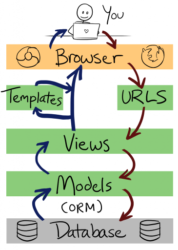
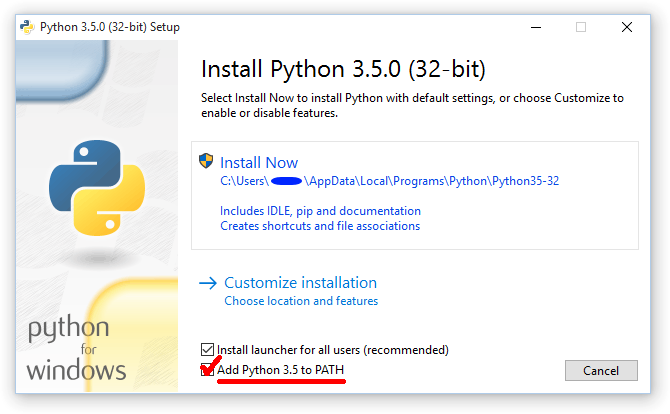
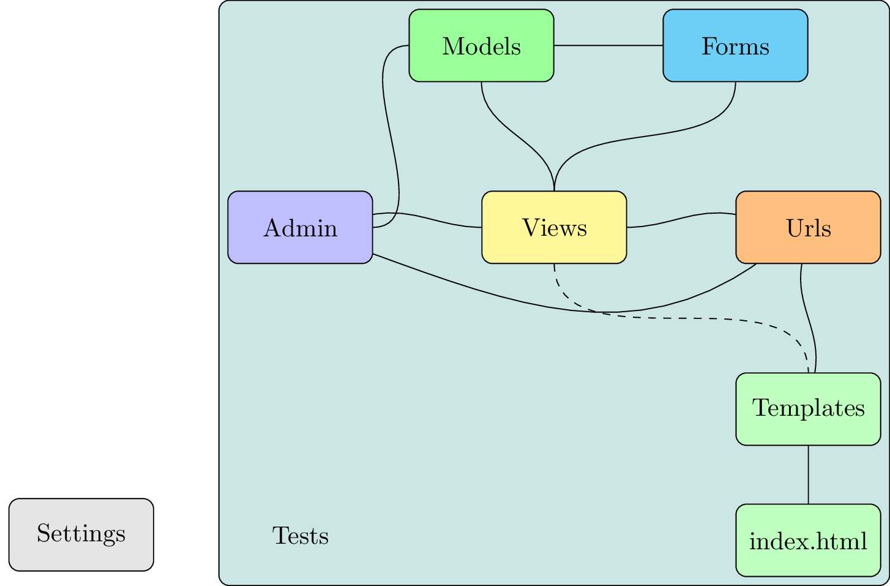
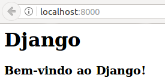

# Mini Curso de Django Básico

Entrar aqui: https://rg3915.github.io/tutoriais/

[Links](links.md)


## Ementa

* [Git](#git)
* [1 min de Python](#1-min-de-python)
* [O que é Django e pra que serve?](#o-que-é-django-e-pra-que-serve)
* [Entendendo o Padrão MVC](#entendendo-o-padrão-mvc)
* [Ambiente Virtual de Desenvolvimento](#ambiente-virtual-de-desenvolvimento)
* [Instalação](#instalação)
* [Qual será Nosso Projeto?](#qual-será-nosso-projeto)
* [Configurando o Django](#configurando-o-django)
* [A view mais simples do mundo](#a-view-mais-simples-do-mundo)
* [Explorando o Admin](#explorando-o-admin)
* [Introdução aos Templates](##introdução-aos-templates)
* [Entendendo o ORM do Django](#entendendo-o-orm-do-django)
* [CRUD com Functions Based Views](#crud-com-functions-based-views)
* [CRUD com Class Based Views](#crud-com-class-based-views)
* [Várias formas de se fazer um formulário](#várias-formas-de-se-fazer-um-formulário)
* [Deploy no Heroku](#deploy-no-heroku)
* [Extra](#extra)

## Objetivo

Criar uma lista de filmes e retornar o filme de maior bilheteria.

* Criar um formulário
* Criar uma lista de filmes
* Ver os detalhes de cada filme


## Git

* Crie uma conta no GitHub
* Gere uma chave ssh na sua máquina
* Configure sua ssh no settings do GitHub

### [Generating a new SSH key](https://help.github.com/articles/generating-a-new-ssh-key-and-adding-it-to-the-ssh-agent/)

```bash
ssh-keygen -t rsa -b 4096 -C "email@example.com"
```

```bash
Generating public/private rsa key pair.
Enter file in which to save the key (/home/vagrant/.ssh/id_rsa): 
Enter passphrase (empty for no passphrase): 
Enter same passphrase again: 
Your identification has been saved in /home/vagrant/.ssh/id_rsa.
Your public key has been saved in /home/vagrant/.ssh/id_rsa.pub.
The key fingerprint is:
28:67:2f:04:39:ff:04:6c:d4:e4:5d:68:04:05:eb:ea email@example.com
The key's randomart image is:
+--[ RSA 4096]----+
|      .o+=o..    |
|     + ..oo.     |
|    + + o..      |
|     = +         |
|    . * S        |
|     = =         |
|      o o        |
|     . .         |
|      E          |
+-----------------+
```

#### Adicionando seu SSH Key no ssh-agent

```bash
eval "$(ssh-agent -s)"
ssh-add ~/.ssh/id_rsa
```

#### Copiando a chave

```bash
cat ~/.ssh/id_rsa.pub
```

#### Configurando o SSH no GitHub

Clique no seu perfil e vá em **Settings**.

Em seguida vá em **SSH and GPG keys**.

Clique no botão **New SSH key** e cole o `id_rsa.pub`.

#### Criando o repositório

Agora crie um novo repositório clicando no icone '+' e em **new repository**.

Vamos chamar o repositório de **djangotutorial**.

Agora clone o projeto digitando

```bash
git clone git@github.com:seunome/djangotutorial.git
cd djangotutorial
```

Para fazer o clone via HTTPS digite

```bash
git clone https://github.com/seunome/djangotutorial.git
```

Talvez você precise configurar no seu terminal os seguintes comandos

```
git config --global user.name "Seu Nome"
git config --global user.email "seuemail@example.com"
```

Edite o README.

```
# Mini Curso de Django Básico

## Instalação

* Clone o repositório.
* Crie um virtualenv com Python 3.
* Ative o virtualenv.
* Instale as dependências.
* Configure a instância com o .env.
* Execute as migrações no banco de dados.
* Execute os testes.
* Rode a aplicação.

git clone https://github.com/seunome/djangotutorial.git
cd djangotutorial
python3 -m venv .venv
source .venv/bin/activate
# .venv\Scripts\activate.bat  # Windows
python -m pip install -r requirements.txt
python contrib/env_gen.py
python manage.py migrate
python manage.py test
python manage.py runserver
```

E vamos subir as alterações para o GitHub.

```bash
git status
git add README.md
git status
git commit -m "First Commit"
git push
```


## 1 min de Python

```python
print("Python")

def soma(a, b):
    return a + b

soma(25,9)

lista = ['a', 10, 5.5]
for i in lista:
    print(i)

for i in range(10):
    print(i)

movie = {
    'name': 'Os Vingadores',
    'category': 'ação',
    'distributor': 'Disney',
    'raised': 1.519,
    'release': '2012-04-27',
}

movie['name']
movie['category']
movie['release']


import datetime


class Movie(object):

    def __init__(self, name='', category='', distributor='', release=''):
        self.name = name
        self.category = category
        self.distributor = distributor
        self.release = release

    def count_string_movie(self):
        return len(self.name)


if __name__ == '__main__':
    movie = Movie()
    movie.name = 'Titanic'
    movie.category = 'aventura'
    movie.distributor = 'Paramount'
    movie.release = datetime.date(1998, 1, 16)
    print(movie)
    print(movie.name)
    print(movie.category)
    print(movie.distributor)
    print(movie.release)
    print(movie.count_string_movie())
```


## O que é Django e pra que serve?

Segundo Django Brasil,

*Django é um framework web de alto nível escrito em Python que estimula o desenvolvimento rápido e limpo.*

* adota o padrão MTV
* possui ORM
* admin
* herança de templates e modelos
* open source

## Quem usa Django?


https://www.djangosites.org/


## Entendendo o Padrão MVC

### MVC x MTV

* Model - é o modelo, a camada de abstração do banco de dados, onde acontece o ORM
* View - é o controlador, onde acontece as regras de negócio e a comunicação entre a base de dados e o navegador
* Templates - é a camada de apresentação, são as páginas html


Veja o processo de um *request* e *response*.




## Ambiente Virtual de Desenvolvimento

O Python 3 já tem um **virtualenv** como bateria inclusa. *virtualenv* é um ambiente onde você isola as dependências do seu projeto.

```bash
python3 -m venv .venv
```

### Ativando o virtualenv

```bash
source .venv/bin/activate
# .venv/Scripts/activate.bat # Windows
```

**Obs:** todos os pacotes instalados com o ambiente ativado serão instalados dentro do ambiente e visíveis somente nele.

**Dica:** No Linux, edite o arquivo `~/.bashrc`.

```bash
alias sa='source .venv/bin/activate;'
```

Assim você cria atalhos para ativar seus ambientes:

```bash
$ sa
```

**Dica:** Para diminuir o caminho do prompt digite

```bash
$ PS1="(`basename \"$VIRTUAL_ENV\"`):/\W$ "
```

O caminho vai ficar assim

```bash
(.venv):/djangotutorial$
```

Onde `(.venv)` é o nome do ambiente e `:/djangotutorial$` é a pasta atual.

Para desativar o ambiente digitamos

```bash
(.venv):/djangotutorial$ deactivate
```


## Instalação

* Python 3
* Pip
* Virtualenv

**Instalando Python 3 no Windows**

Vá em www.python.org/downloads/ e baixe Python 3.6. Ao instalar não esqueça de marcar o check 'Add Python 3.6 to PATH'.



**Instalando Python 3 no Linux ou Mac**

Sugiro este tutorial de instalação com pyenv https://github.com/rg3915/django-experience/wiki/Instalando-o-pyenv


## Qual será Nosso Projeto?

* Ambiente: .venv
* Projeto: myproject
* App: core

### Instalando o Django

```bash
pip install django
```

Vendo o que foi instalado

```bash
pip freeze
Django==1.11
```

Crie o `requirements.txt` (os ingredientes do bolo)

```bash
pip freeze > requirements.txt
```

### Criando o projeto e a App

Para criar o **projeto** digite

```bash
django-admin.py startproject myproject .
```

repare no ponto final do comando, isto permite que o arquivo `manage.py` fique na pasta "principal", pasta `.venv`.

Criando a **app**

```bash
cd myproject
python ../manage.py startapp core
cd ..
```

**Dica:** você pode digitar

```bash
manage startapp core
```

mas para funcionar este comando você deve editar o `~/.bashrc`.

```bash
alias manage='python $VIRTUAL_ENV/../manage.py'
```

O que temos até aqui?

    .
    |-- manage.py
    |-- myproject
    |   |-- core
    |   |   |-- admin.py
    |   |   |-- apps.py
    |   |   |-- __init__.py
    |   |   |-- models.py
    |   |   |-- tests.py
    |   |   `-- views.py
    |   |-- __init__.py
    |   |-- settings.py
    |   |-- urls.py
    |   `-- wsgi.py
    



## Django funcionando em nível 0

Declarando o app `core` em `settings.py`

```python
INSTALLED_APPS = [
    # ...
    'myproject.core',
]
```

Criando a primeira migração

```bash
manage migrate
```

Rodando a aplicação

```bash
manage runserver
# ou
# manage runserver 8080
```

[http://localhost:8000/](http://localhost:8000/)


## Configurando o Django

> **Importante:** nunca coloque sua `SECRET_KEY` no git.

Vamos editar o `settings.py`.

Extraia a `SECRET_KEY`, crie um arquivo `.env` na pasta principal e coloque-o lá.

```bash
touch .env
```

O `.env` vai ficar assim:

```python
SECRET_KEY=su4_s3cr3t_k3y_sup3r_s3cr3t4
```

**Note** que eu tirei as aspas simples e o espaço em branco entre o sinal de igual.

E o `settings.py` vai ficar assim:

```python
from decouple import config, Csv

SECRET_KEY = config('SECRET_KEY')
```

Repare que estamos usando o [python-decouple](https://github.com/henriquebastos/python-decouple). Para instala-lo digite

```bash
pip install python-decouple
```

Voltando ao `.env` façamos

```python
SECRET_KEY=su4_s3cr3t_k3y_sup3r_s3cr3t4
DEBUG=True
ALLOWED_HOSTS=127.0.0.1, .localhost
```

E o `settings.py`

```python
SECRET_KEY = config('SECRET_KEY')

DEBUG = config('DEBUG', default=False, cast=bool)

ALLOWED_HOSTS = config('ALLOWED_HOSTS', default=[], cast=Csv())
```

Configurando melhor o banco de dados

```python
from dj_database_url import parse as dburl

default_dburl = 'sqlite:///' + os.path.join(BASE_DIR, 'db.sqlite3')
DATABASES = {
    'default': config('DATABASE_URL', default=default_dburl, cast=dburl),
}
```

**Note** que estamos usando o [dj-database-url](https://github.com/kennethreitz/dj-database-url).

```bash
pip install dj-database-url
```


### .gitignore

Antes de "commitar" nosso código digite `git status`.

Repare que a pasta `.venv` e o `db.sqlite3` serão versionados, mas não deve.

> **Boas práticas:** NÃO versione seu ambiente virtual e nem seu banco de dados.

Vamos editar o `.gitignore`.

```
.venv
*.sqlite3
```

Pronto! Agora você pode dar seu primeito `commit`.

```bash
git add .
git commit -m "First project"
git push
```

## A view mais simples do mundo

    .
    |-- 
    |-- myproject
    |   |-- core
    |   |   |-- ...
    |   |   `-- views.py
    |   |-- settings.py
    |   |-- urls.py

### Editando views.py

```python
# from django.shortcuts import render
from django.http import HttpResponse


def home(request):
    return HttpResponse('<h1>Django</h1><h3>Bem-vindo ao Django!</h3>')
```

### Editando urls.py

```python
from django.conf.urls import url
from django.contrib import admin
from myproject.core.views import home

urlpatterns = [
    url(r'^$', home),
    url(r'^admin/', admin.site.urls),
]
```




## Explorando o Admin

```bash
manage createsuperuser --username='admin' --email=''
```


## Introdução aos Templates

### Editando o settings.py

```python
LANGUAGE_CODE = 'pt-br'

TIME_ZONE = 'America/Sao_Paulo'

LOGIN_URL = '/admin/login'
```

## Testes


### Teste: Verificar se existe a página *index.html*.

```python
from django.test import TestCase


class HomeTest(TestCase):

    def setUp(self):
        self.resp = self.client.get('/')

    def test_get(self):
        ''' get / deve retornar status code 200. '''
        self.assertEqual(200, self.resp.status_code)

    def test_template(self):
        ''' Home deve usar template index.html '''
        self.assertTemplateUsed(self.resp, 'index.html')
```

**Leia**: "pytest: escreva menos, teste mais" - Erick Wilder de Oliveira - https://goo.gl/8E9FB1


### Editando views.py

```python
from django.shortcuts import render
# from django.http import HttpResponse

# def home(request):
#     return HttpResponse('<h1>Django</h1><h3>Bem-vindo ao Django!</h3>')

def home(request):
    return render(request, 'index.html')
```

### Criando o index.html

Estando na pasta `venv` digite

```bash
cd myproject
mkdir -p core/templates
echo "<html><body><h1>Tutorial Django</h1><h3>Bem-vindo ao Django.</h3></body></html>" > core/templates/index.html
```

Explorando o [layoutit](http://www.layoutit.com/)


## Editando models.py

**Básico**: Filmes


```python
from django.db import models
from django.core.urlresolvers import reverse_lazy as r


class Distributor(models.Model):
    distributor = models.CharField('distribuidor', max_length=50, unique=True)

    class Meta:
        ''' É uma classe Builtin do Django com recursos adicionais '''
        ordering = ['distributor']
        verbose_name = 'distribuidor'
        verbose_name_plural = 'distribuidores'

    def __str__(self):
        ''' Retorna o distributor ao invés de 'Distributor.object' '''
        return self.distributor


class Category(models.Model):
    category = models.CharField('categoria', max_length=50, unique=True)

    class Meta:
        ordering = ['category']
        verbose_name = 'categoria'
        verbose_name_plural = 'categorias'

    def __str__(self):
        return self.category


class Movie(models.Model):
    movie = models.CharField('filme', max_length=100)
    category = models.ForeignKey(
        'Category', verbose_name='categoria', related_name='movie_category')
    distributor = models.ForeignKey(
        'Distributor', verbose_name='distribuidor', related_name='movie_distributor')
    raised = models.DecimalField('arrecadou', max_digits=4, decimal_places=3)
    liked = models.BooleanField('gostou', default=True)
    release = models.DateTimeField(u'lançamento')

    class Meta:
        ''' O sinal de menos ordena a data de forma decrescente, ou seja,
        mais recente primeiro. '''
        ordering = ['-release']
        verbose_name = 'filme'
        verbose_name_plural = 'filmes'

    def __str__(self):
        return self.movie

    def get_absolute_url(self):
        return r('core:movie_detail', kwargs={'pk': self.pk})
```

Note que `get_absolute_url` usa `reverse_lazy`, que no caso foi renomeado através de um *alias* para `r`.

Note também que `'core:movie_detail'` é o `namespace` e `name` da url respectivamente.

> Nota: caso dê algum erro, comente esta função temporariamente.


### Tipos de campos

https://docs.djangoproject.com/en/1.10/ref/models/fields/


### Atualizando o banco

```bash
python manage.py makemigrations
python manage.py migrate
```


## Entendendo o ORM do Django

Explorando um pouco as queryset.

```bash
$ python manage.py shell
Python 3.5.0 (default, Dec  8 2015, 01:17:16) 
[GCC 4.8.4] on linux
Type "help", "copyright", "credits" or "license" for more information.
(InteractiveConsole)
>>>
```

Precisamos importar o models.

```python
>>> from myproject.core.models import Distributor, Category, Movie
>>> import datetime
>>> Distributor.objects.create(distributor='Disney')
>>> Category.objects.create(category='ação')
>>> category = Category.objects.get(category='ação')
distributor = Distributor.objects.get(distributor__icontains='disney')
Movie.objects.create(
    movie='Os Vingadores',
    category=category,
    distributor=distributor,
    raised=1.519,
    release=datetime.date(2012, 4, 27)
)
>>> m = Movie.objects.all()
>>> m
>>> print(m.query)
```


https://docs.djangoproject.com/en/1.10/ref/models/querysets/

https://pt.wikipedia.org/wiki/Lista_de_filmes_de_maior_bilheteria


### Admin novamente

```python
from django.contrib import admin
from .models import Distributor, Category, Movie


admin.site.register(Distributor)
admin.site.register(Category)
admin.site.register(Movie)
```


### Turbinando o shell com iPython e django extensions

```bash
pip install ipython
pip install django-extensions
```

Em `settings.py`

```python
INSTALLED_APPS = [
    # ...
    # thirty apps
    'django_extensions',
    # ...
]
```

Agora podemos digitar

```bash
manage shell_plus
```


### Explorando mais o shell do Django

Façamos

```bash
mkdir shell
touch shell/{categorys.py,distributors.py,movies.py}
```

Veja o código de cada arquivo em [shell/](shell/).

Para rodar o script façamos

```bash
manage shell < shell/categorys.py
manage shell < shell/distributors.py
manage shell < shell/movies.py
```

Leia mais

```python
from myproject.core.models import Distributor, Category, Movie
import datetime

# Podemos criar uma instância do objeto e depois salvar.
obj = Distributor(distributor='Paramount Pictures')
obj.save()

# Veja um exemplo de como criar um Distributor diretamente.
Distributor.objects.create(distributor='Universal Pictures')
Distributor.objects.create(distributor='Walt Disney Pictures')

CATEGORY_LIST = ['ação', 'animação', 'aventura', 'comedia', 'guerra', 'suspense']
# Usando um List Comprehension podemos definir todos os objetos a serem
# inseridos no Django
obj = [Category(category=val) for val in CATEGORY_LIST]
# O comando bulk_create é muito rápido!
Category.objects.bulk_create(obj)

# O comando get "pega" um objeto
category = Category.objects.get(category='ação')
distributor = Distributor.objects.get(distributor__istartswith='Warner')
Movie.objects.create(
    movie='O Exterminador do Futuro',
    category=category,  # para ser usado aqui
    distributor=distributor,
    raised=1.756,
    release=datetime.date(1984, 10, 26)
)

category = Category.objects.get(category='aventura')
distributor = Distributor.objects.get(distributor='Lionsgate')
Movie.objects.create(
    movie='Jogos Vorazes',
    category=category,
    distributor=distributor,
    raised=2.308,
    release=datetime.date(2012, 3, 23)
)

q = Movie.objects.all()  # listando todos os filmes
q.count()
q
q.values()  # dicionario
q.values_list()  # lista

for i in q.values():
    print(i)

# Experimente
for i in q:
    i.movie, i.category, i.raised

dir(q)  # veja todas as opções do objeto.

# Exemplos de filtro
Movie.objects.filter(category='ação')  # retorna erro
Movie.objects.filter(category__category='ação')
Movie.objects.filter(distributor__distributor__icontains='gate')

# Exemplo de update
Movie.objects.filter(movie__icontains='Exterminador').update(
    movie='O Exterminador do Futuro: Gênesis', release=datetime.date(2015, 7, 1))

# Exemplo de delete
Movie.objects.filter(id=1).delete()
# Customer.objects.all().delete() # perigoso
t = Movie.objects.get(movie='Titanic')
t
t.id
Movie.objects.filter(id=t.id).delete()
Movie.objects.filter(movie='Titanic')
Movie.objects.filter(movie='Titanic').count()

Movie.objects.filter(release__year=2012).count()
# Movie.objects.filter(release__year__gte=2000).count()  # filmes > 2000

# Filme de maior bilheteria
from django.db.models import Max
q = Movie.objects.all().aggregate(Max('raised'))
q
Movie.objects.filter(raised=q['raised__max'])
```


## CRUD com Functions Based Views

### Views.py

```python
from django.shortcuts import render
from .models import Movie


def movie_list(request):
    movies = Movie.objects.all()
    context = {'movies': movies}
    return render(request, 'core/movie_list.html', context)
```

### urls.py

```bash
touch core/urls.py
```

Editando `core/urls.py`

```python
from django.conf.urls import url
from .views import home, movie_list

urlpatterns = [
    url(r'^$', home, name='home'),
    url(r'^movie/$', movie_list, name='movie_list'),
]
```

Refatorando `urls.py`

```python
from django.conf.urls import include, url
from django.contrib import admin

urlpatterns = [
    url(r'', include('myproject.core.urls', namespace='core')),
    url(r'^admin/', admin.site.urls),
]
```

### Criando os templates

```bash
mkdir core/templates/core
touch core/templates/{base,menu}.html
touch core/templates/core/{movie_list,movie_detail,movie_form}.html
```

Temos

    core
    ├── admin.py
    ├── models.py
    ├── templates
    │   ├── base.html
    │   ├── index.html
    │   ├── menu.html
    │   └── core
    │       ├── movie_detail.html
    │       ├── movie_form.html
    │       └── movie_list.html
    ├── tests.py
    └── views.py


#### Variáveis

Acessando objetos

```python
{{ objeto }}
```

Acessando atributos

```python
{{ objeto.atributo }}
```

Tags

```python

```

Exemplo:

```python

  <!-- algum comando -->



  {{ item.atributo }}

```

Vamos editar:

**menu.html**

```html
<!-- Menu -->
<div class="navbar navbar-inverse navbar-fixed-top" role="navigation">
  <div class="container-fluid">
    <div class="navbar-header">
      <button type="button" class="navbar-toggle" data-toggle="collapse" data-target=".navbar-collapse">
        <span class="icon-bar"></span>
        <span class="icon-bar"></span>
        <span class="icon-bar"></span>
      </button>
    </div>
    <div class="navbar-collapse collapse">
      <ul class="nav navbar-nav">
        <li class="current"><a href=""><span class="glyphicon glyphicon-home"></span> Home</a></li>
        <li><a href=""><span class="glyphicon glyphicon-film"></span> Filmes</a></li>
      </ul>
      <ul class="nav navbar-nav navbar-right">
        <li><a href="">Admin</a></li>
      </ul>
    </div>
  </div>
</div>
```

**base.html**

```html

<!DOCTYPE html>
<html lang="en">
  <head>

    <meta charset="utf-8">
    <meta name="viewport" content="width=device-width, initial-scale=1.0">
    <link rel="shortcut icon" href="https://www.djangoproject.com/favicon.ico">


    
      <title>Filmes</title>
    

    <!-- Bootstrap core CSS -->
    <link rel="stylesheet" href="https://maxcdn.bootstrapcdn.com/bootstrap/3.3.7/css/bootstrap.min.css">
    <script src="https://code.jquery.com/jquery-2.2.4.min.js"></script>
    <script src="https://maxcdn.bootstrapcdn.com/bootstrap/3.3.7/js/bootstrap.min.js"></script>

    <style type="text/css">
      /* Move down content because we have a fixed navbar that is 50px tall */
      body {
        padding-top: 60px;
        padding-bottom: 40px;
        /*color: #5a5a5a;*/
      }
    </style>

  </head>
  <body>

    

    
  </body>
</html>
```


### Herança de templates

**index.html**

```html



  <div class="container">
    <div class="jumbotron">
      <h1>Tutorial Django</h1>
      <h3>Bem-vindo ao Django!</h3>
    </div>
  </div>

```

**movie_list.html**

```html




<div class="container">

  <div class="page-header">
      <a class="btn btn-primary pull-right" href=""><i class="glyphicon glyphicon-plus"></i> Adicionar filme</a>
    <h2><a href="?great_movie=1">Filme de maior bilheteria</a></h2>
  </div>

  
    <table class="table table-striped">
      <thead>
        <tr>
          <th>Filme</th>
          <th>Categoria</th>
          <th>Distribuidor</th>
          <th>Bilheteria (bilhões)</th>
          <th>Lançamento</th>
          <th>Gostou</th>
        </tr>
        </thead>
        <tbody>
        
          <tr>
            <td><a href="{{ movie.get_absolute_url }}">{{ movie.movie }}</a></td>
            <td>{{ movie.category }}</td>
            <td>{{ movie.distributor }}</td>
            <td>U$ {{ movie.raised }}</td>
            <td>{{ movie.release|date:"d/m/Y" }}</td>
            
              <td><span class="glyphicon glyphicon-ok-sign" style="color: #44AD41"></span></td>
            
              <td><span class="glyphicon glyphicon-minus-sign" style="color: #DE2121"></span></td>
            
          </tr>
        
        </tbody>
    </table>
  
    <p class="alert alert-warning">Sem itens na lista.</p>
  

</div>


```

**Atenção:** provavelmente vai dar erro em `href=""` porque a url não existe ainda. Deixe `href` vazio temporariamente.

Talvez dê erro em `href="{{ movie.get_absolute_url }}"` também.


### Visualizando os detalhes

```python
from django.shortcuts import render, get_object_or_404


def movie_detail(request, pk):
    movie = get_object_or_404(Movie, pk=pk)
    context = {'movie': movie}
    return render(request, 'core/movie_detail.html', context)
```

#### urls.py

```python
url(r'^movie/(?P<pk>\d+)/$', movie_detail, name='movie_detail'),
```

Agora você pode voltar com `href="{{ movie.get_absolute_url }}"`.

#### movie_detail.html

```html



  <div class="container">
    <div class="row">
      <ul class="breadcrumb">
        <li><a href="">Filmes</a> <span class="divider"></span></li>
        <li class="active">{{ movie.movie }}</li>
      </ul>

      <div class="col-sm-6 col-md-4">
        <div class="list-group">
          <h1>
            {{ movie.movie}}
            
              <td><span class="pull-right glyphicon glyphicon-ok-sign" style="color: #44AD41"></span></td>
            
              <td><span class="pull-right glyphicon glyphicon-minus-sign" style="color: #DE2121"></span></td>
            
          </h1>
          <div class="list-group-item">
            <h4>{{ movie.category }}</h4>
          </div>
          <div class="list-group-item">
            <h4>{{ movie.distributor }}</h4>
          </div>
          <div class="list-group-item">
            <h3>U$ {{ movie.raised }}</h3>
          </div>
          <div class="list-group-item">
            <h4>{{ movie.release|date:"d/m/Y" }}</h4>
          </div>
        </div>
      </div>
    </div>
  </div>

```


http://getbootstrap.com/

http://getbootstrap.com/examples/theme/

http://www.layoutit.com/


## CRUD com Class Based Views

https://docs.djangoproject.com/en/1.10/topics/class-based-views/

https://ccbv.co.uk/

**Leia**: "Django Class Based Views - o que são e por que usar" - Caio Carrara https://goo.gl/xnfqx1

https://speakerdeck.com/cacarrara/django-class-based-views

### Editando o views.py para lista

```python
from django.views.generic import CreateView, ListView, DetailView
from django.db.models import Max


class MovieList(ListView):
    template_name = 'core/movie_list.html'
    model = Movie
    context_object_name = 'movies'

    def get_queryset(self):
        m = Movie.objects.all()
        # Filme de maior bilheteria
        if self.request.GET.get('great_movie', False):
            q = Movie.objects.all().aggregate(Max('raised'))
            m = Movie.objects.filter(raised=q['raised__max'])
        return m


class MovieDetail(DetailView):
    template_name = 'core/movie_detail.html'
    model = Movie
```

## Formulários

### Editando o views.py para formulário

```python
from django.core.urlresolvers import reverse_lazy as r


class MovieCreate(CreateView):
    template_name = 'core/movie_form.html'
    model = Movie
    fields = '__all__'
    success_url = r('core:movie_list')
```

### Refatorando o urls.py

```python
from django.conf.urls import url
from myproject.core import views as c

urlpatterns = [
    url(r'^$', c.home, name='home'),
    url(r'^movie/$', c.MovieList.as_view(), name='movie_list'),
    url(r'^movie/(?P<pk>\d+)/$', c.MovieDetail.as_view(), name='movie_detail'),
    url(r'^movie/add/$', c.MovieCreate.as_view(), name='movie_add'),
]
```

### Editando movie_form.html


```html




<div class="container">
  <form class="form-horizontal" action="." method="POST">
      <legend>Cadastrar</legend>
      
      {{ form.as_p }}

    <div class="form-group">
        <div class="col-sm-10 col-sm-offset-2">
          <button type="submit" id="id_submit" class="btn btn-primary">Salvar</button>
        </div>
      </div>
  </form>
</div>


```


## Várias formas de se fazer um formulário

Existem várias formas de se criar um formulário, qual deles eu uso?

1 - Fazendo tudo na mão com html puro

```html




<div class="container">
  <form class="form-horizontal" action="." method="POST">
    <legend>Cadastrar</legend>
    

    <div class="form-group">
      <label for="id_movie">Filme</label>
      <input type="text" id="id_movie" name="movie" class="form-control">
    </div>
    
    <div class="form-group">
      <label for="id_category">Categoria</label>
      <input type="text" id="id_category" name="category" class="form-control" placeholder="Tem que usar select">
    </div>

    <!-- ... -->

    <div class="form-group">
      <div class="col-sm-10 col-sm-offset-2">
        <button type="submit" id="id_submit" class="btn btn-primary">Salvar</button>
      </div>
    </div>
  </form>
</div>


```


2 - Usando as tags do Django

```
{{ form }}

{{ form.as_p }}

{{ form.as_ul }}

{{ form.as_table }}
```

Nosso formulário

```html



  <form action="" method="POST">
    
    {{ form.as_p }}
  </form>

```


3 - Usando `{{ field.label }}` e `{{ field }}`

```html

  <div class="form-group">
    <div class="control-label col-sm-2">
      {{ field.errors }}
      {{ field.label }}
    </div>
    <div class="col-sm-2">
      {{ field }}
    </div>
  </div>

```


4 - Usando bibliotecas como o [django-bootstrap-form](https://github.com/tzangms/django-bootstrap-form)

Antes digite

```bash
pip install django-bootstrap-form
```

E em `settings.py`, em `INSTALLED_APPS` insira `'bootstrapform',`.

```python
INSTALLED_APPS = [
    # ...
    # thirty apps
    # ...
    'bootstrapform',
    # my apps
    'myproject.core',
]
```

Editando o formulário

```






<div class="container">
  <form class="form-horizontal" action="." method="POST">
    <legend>Cadastrar</legend>
    
    {{ form.movie|bootstrap_horizontal }}
    {{ form.category|bootstrap_horizontal }}
    {{ form.distributor|bootstrap_horizontal }}
    {{ form.raised|bootstrap_horizontal }}
    {{ form.liked|bootstrap_horizontal }}
    {{ form.release|bootstrap_horizontal }}

    <div class="form-group">
      <div class="col-sm-10 col-sm-offset-2">
        <button type="submit" id="id_submit" class="btn btn-primary">Salvar</button>
      </div>
    </div>
  </form>
</div>


```


## Deploy no Heroku

* Criar conta no Heroku
* Instalar [Heroku Toolbelt](https://devcenter.heroku.com/articles/heroku-command-line)
* no terminal digite `heroku`

```bash
heroku login
heroku --version
```

Nós temos um projeto, mas podemos ter várias instâncias. Então precisamos separar os elementos da instância.

```bash
pip install python-decouple
```

Lê as configurações da instância a partir das variáveis de ambiente do sistema a partir do arquivo `.env`.

```bash
pip install dj-database-url
```

Configurar os arquivos estáticos, em `settins.py` digite

```python
STATIC_ROOT = os.path.join(BASE_DIR, 'staticfiles')
```


O `dj-static` que servirá os arquivos, pois o Django não faz isso.

Configurar `wsgi.py`

```python
from dj_static import Cling

...

application = Cling(get_wsgi_application())
```

```bash
pip freeze > requirements.txt
```

Inserir em `requirements.txt`

```
gunicorn==19.4.1
psycopg2==2.6.1
```

O gunicorn é o servidor de aplicação.

E o psycopg2 é o drive do Postgres para o Python.

Crie o arquivo `Procfile`

```bash
echo "web: gunicorn myproject.wsgi --log-file -" > Procfile
```

E `runtime.txt`

```bash
echo python-3.6 > runtime.txt
```

Suba as alterações para o GitHub

```bash
git status
git add .
git commit -m "Configurações para Heroku"
git push
```

Crie uma app no Heroku

```bash
heroku apps:create djangotutorial-regis
```

Veja o novo repositório

```bash
git remote -v
```

Primeiro enviamos as configurações para o Heroku

```bash
heroku config
heroku config:push
heroku config
git push heroku master --force
heroku open
```

https://github.com/xavdid/heroku-config

```bash
heroku plugins:install heroku-config
```

Se não der certo use a configuração manual

```bash
heroku config:set SECRET_KEY=su4_s3cr3t_k3y_sup3r_s3cr3t4
heroku config:set DEBUG=False
heroku config:set ALLOWED_HOSTS="127.0.0.1, .localhost"
```

```bash
heroku config
heroku open
```


## Livros


[Django Essencial de Julia Elman da Novatec](http://www.novatec.com.br/livros/django/)

[Two Scoops of Django 1.8 de Daniel and Audrey Roy Greenfeld](https://www.twoscoopspress.com/) (@pydanny and @audreyr)

[The Django Book](http://djangobook.com/)


## Cursos

[Welcome to the Django](http://welcometothedjango.com.br/) by @henriquebastos

[Construa um E-Commerce com Python 3 e Django](http://bit.ly/2duS45N) by @GilenoFilho

[Python para Zumbis](https://goo.gl/swsHmw)

[CodingEntrepreneurs Try Django 1.9](http://youtu.be/yfgsklK_yFo)


## Final

```python
# Filme de maior bilheteria
from django.db.models import Max
q = Movie.objects.all().aggregate(Max('raised'))
q
m = Movie.objects.filter(raised=q['raised__max'])
m.values()
m[0].movie, m[0].raised
```

## Extra

### Refatorando o Admin.py

```python
from django.contrib import admin
from myproject.core.models import Distributor, Category, Movie


@admin.register(Movie)
class MovieAdmin(admin.ModelAdmin):
    search_fields = ('movie', 'distributor__distributor')
    list_display = ('movie', 'distributor')


admin.site.register(Distributor)
admin.site.register(Category)
```

https://docs.djangoproject.com/en/1.10/ref/contrib/admin/#modeladmin-options

### Arquivos estáticos

Vamos criar algumas pastas

```bash
mkdir -p core/static/{css,img,js}
```

Em `css` vamos criar um `main.css`

```bash
touch core/static/css/main.css
```

Seu conteúdo será

```css
body {
  padding-top: 60px;
  padding-bottom: 40px;
}
```

Baixe uma imagem bem bonita e coloque em `img`. Eu escolhi essa:


Agora vamos refatorar `base.html`. Troque `<style>...</style>` por

```html
<link rel="stylesheet" href="">
```

Em `main.css` acrescente

```css
#image {
    width: 200px;
}
```

E em `index.html` acrescente

```html
<div class="pull-right">
  
</div>
```

O `index.html` vai ficar assim:

```html




  <div class="container">
    <div class="jumbotron">
      <div class="pull-right">
        
      </div>
      <h1>Tutorial Django</h1>
      <h3>Bem-vindo ao Django!</h3>
    </div>
  </div>

```


[Links](links.md)

Participem do [Grupy-SP](www.meetup.com/pt-BR/Grupy-SP/)

Meu portfólio http://rg3915.github.io/
